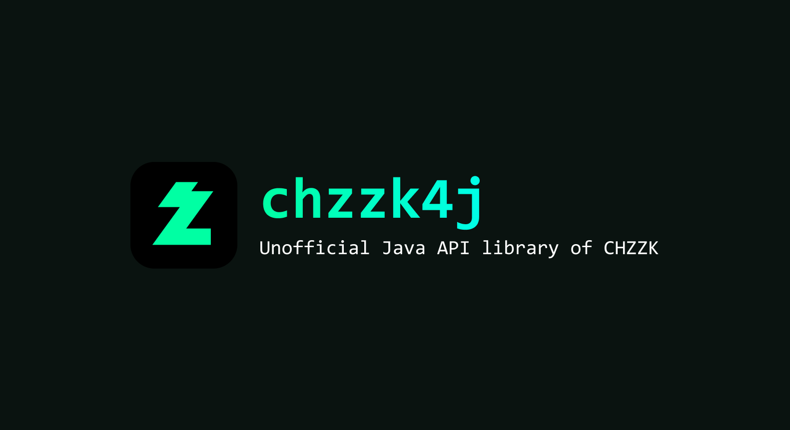

# chzzk4j

* **0.0.12 이하 버전을 사용하신다면, [과거 버전의 문서](https://github.com/R2turnTrue/chzzk4j/blob/2a5936c9570220957c3ef4f13462d12d4d19e4ff/README.md) 파일을 확인해주세요!**

 / 
[Example Minecraft Plugin](https://github.com/R2turnTrue/chzzk4j_demo) / 
[Discord Server](https://discord.gg/GgNXbzZeDk)

Unofficial Java API library of CHZZK (치지직, the video streaming service of Naver)

* This library is not completed. Please contribute a lot through Pull-Request!
* Please feel free to create an issue if you have any problems!

## installation

```kotlin
repositories {
    mavenCentral()
}

dependencies {
    implementation("io.github.R2turnTrue:chzzk4j:0.1.1")
}
```

## usage
Check at [our docs](https://r2turntrue.gitbook.io/chzzk4j)!

## examples
### minimal chat example
```java
ChzzkClient client = new ChzzkClientBuilder("API_CLIENT_ID", "API_SECRET")
        .build();
ChzzkChat chat = new ChzzkChatBuilder(client,
        "CHANNEL_ID")
        .build();

chat.on(ConnectEvent.class, (evt) -> {
    System.out.println("connected to chat :)");
});

chat.on(ChatMessageEvent.class, (evt) -> {
    ChatMessage msg = evt.getMessage();
    
    if (msg.getProfile() == null) {
        System.out.println(String.format("익명: %s", msg.getContent()));
        return;
    }

    System.out.println(
            String.format("[Chat] %s: %s",
                msg.getProfile().getNickname(),
                msg.getContent()));
});

chat.connectBlocking();
```

## features

- [x] get channel information & rules
- [x] get current user's information
- [x] get channel followed status
- [x] async chat integration (read/send)
- [x] get recommendation channels
- [x] fix invalid json (chat)
- [x] load emoji pack
- [x] get live status
- [x] get live detail

### need to implement

- [ ] write javadocs of all methods/classes/etc..
- [ ] parse emoji from chat message
- [ ] get following channels of user that logged in
- [ ] get video information
- [ ] get cheese ranking

### references

- [kimcore/chzzk](https://github.com/kimcore/chzzk)
- [Chzzk Official API - Session Test Results](https://gist.github.com/fi-xz/69ce1f35ca1b2318a2b410c0d5757e0f#file-main-kt)