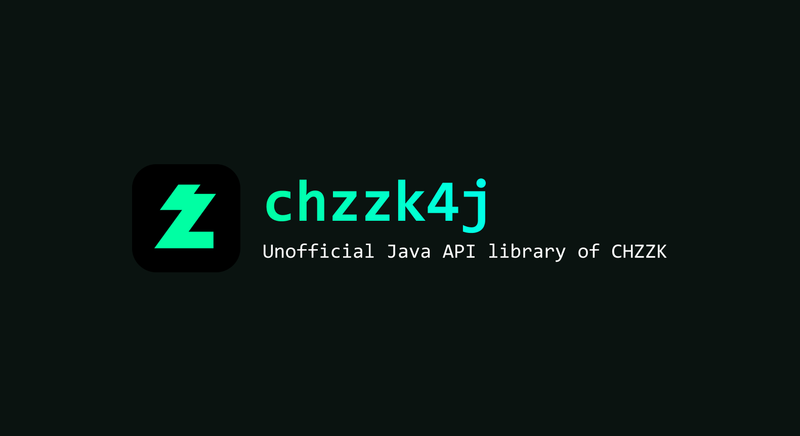

# chzzk4j

* **0.0.12 이하 버전을 사용하신다면, [과거 버전의 문서](https://github.com/R2turnTrue/chzzk4j/blob/2a5936c9570220957c3ef4f13462d12d4d19e4ff/README.md) 파일을 확인해주세요!**

 / 
[예시 마인크래프트 플러그인](https://github.com/R2turnTrue/chzzk4j_demo) / 
[디스코드 서버](https://discord.gg/GgNXbzZeDk) /
[SDK 문서](https://r2turntrue.gitbook.io/chzzk4j)

치지직의 비공식 Java SDK 라이브러리입니다.

* 이 라이브러리는 아직 완성되지 않았습니다. 많은 풀 리퀘스트 부탁드립니다!!
* 이슈가 생기면 언제나 깃허브 이슈로 알려주세요!

## 설치

> [!Warning]
> ## `r2turntrue` != `R2turnTrue`
> **Maven Central에서 `r2turntrue`와 `R2turnTrue`를 다르게 취급합니다!!**
> ### 최신 버전을 사용한다면..
> Group ID로 `io.github.r2turntrue`를 사용하세요!
> 
> ### 0.1.1 이하 구버전을 사용한다면..
> 0.1.1 버전 **이하**의 경우, Group ID로 `io.github.R2turnTrue`를 사용해야 합니다.

```kotlin
repositories {
    mavenCentral()
}

dependencies {
    implementation("io.github.r2turntrue:chzzk4j:0.1.4")
}
```

## 사용 방법
[문서](https://r2turntrue.gitbook.io/chzzk4j)에서 확인하세요!

## 간단한 예제

### 레거시 채팅 예제
```java
ChzzkClient client = new ChzzkClientBuilder() // 레거시 챗은 비공개 API이기 때문에, API 키가 필요하지 않습니다.
        .build();
ChzzkChat chat = new ChzzkChatBuilder(client,
        "CHANNEL_ID")
        .build();

chat.on(ConnectEvent.class, (evt) -> {
    System.out.println("connected to chat :)");
});

chat.on(ChatMessageEvent.class, (evt) -> {
    ChatMessage msg = evt.getMessage();
    
    if (msg.getProfile() == null) {
        System.out.println(String.format("익명: %s", msg.getContent()));
        return;
    }

    System.out.println(
            String.format("[Chat] %s: %s",
                msg.getProfile().getNickname(),
                msg.getContent()));
});

chat.connectBlocking();
```

### OpenAPI 채팅 예제 (세션)
```java
var adapter = new ChzzkOauthLoginAdapter(5000);
var client = new ChzzkClientBuilder(apiClientId, apiSecret)
        .withDebugMode()
        .withLoginAdapter(adapter)
        .build();

System.out.println(adapter.getAccountInterlockUrl(apiClientId, false)); // Show Login URL

client.loginAsync().join(); // Wait for the user to login by the interlock URL

var session = new ChzzkSessionBuilder(client)
        .buildUserSession();

session.subscribeAsync(ChzzkSessionSubscriptionType.CHAT).join();

session.on(SessionConnectedEvent.class, (event) -> {
    System.out.println("Connected!");
});

session.on(SessionDisconnectedEvent.class, (event) -> {
    System.out.println("Disconnected :(");
});

session.on(SessionChatMessageEvent.class, (event) -> {
    var msg = event.getMessage();
    System.out.printf("[CHAT] %s: %s [at %s]%n", msg.getProfile().getNickname(), msg.getContent(), msg.getMessageTime());
});

session.on(SessionRecreateEvent.class, (event) -> {
    System.out.println("Recreating the session...");
});

session.on(SessionSubscribedEvent.class, (event) -> {
    System.out.println("Yeah I subscribed to: " + event.getEventType());
});

session.on(SessionUnsubscribedEvent.class, (event) -> {
    System.out.println("Yeah I unsubscribed to: " + event.getEventType());
});

session.createAndConnectAsync().join();
```

### 채팅 설정 바꾸기
```java
ChzzkChatSettings settings = client.fetchChatSettings().join();

// 본인인증 여부 설정 조건을 변경합니다.
settings.setChatAvailableCondition(ChzzkChatSettings.ChatAvailableCondition.REAL_NAME);

// 채팅 참여 범위 설정 조건을 변경합니다.
settings.setChatAvailableGroup(ChzzkChatSettings.ChatAvailableGroup.FOLLOWER);
// (위 ChatAvailableGroup이 FOLLOWER일 경우) 최소 팔로잉 기간을 설정합니다.
settings.setMinFollowerMinute(ChzzkChatSettings.MinFollowerMinute.M_60);
// (위 ChatAvailableGroup이 FOLLOWER일 경우) 구독자는 최소 팔로잉 기간 조건 대상에서 제외/허용 할지 여부를 설정합니다.
settings.setAllowSubscriberInFollowerMode(false);

// 변경된 방송 설정을 서버에 전송합니다.
client.modifyChatSettings(settings).join();
```

## 기능

- [x] 채널 이름, 규칙 불러오기
- [x] 현재 사용자의 정보 불러오기
- [x] 채널 팔로잉 상태 불러오기
- [x] 비동기 채팅 연동
- [x] 추천 채널 받아오기
- [x] 잘못된 JSON 고치기 (채팅)
- [x] 이모지 팩 불러오기
- [x] 실시간 상태 받아오기 (live status)
- [x] 실시간 상태 받아오기 (live detail)

### 구현할 것들

- [ ] 모든 메소드, 클래스 등등 Javadoc 완성하기
- [ ] 채팅 메시지에서 이모지 파싱하기
- [ ] 로그인된 유저의 팔로잉 목록 가져오기
- [ ] 동영상 정보 가져오기
- [ ] 치즈 후원 랭킹 가져오기

### 참고 자료

- [kimcore/chzzk](https://github.com/kimcore/chzzk)
- [Chzzk Official API - Session Test Results](https://gist.github.com/fi-xz/69ce1f35ca1b2318a2b410c0d5757e0f#file-main-kt)