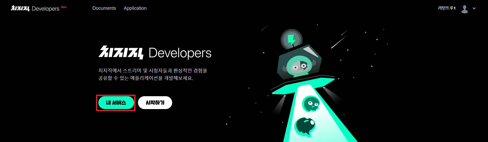
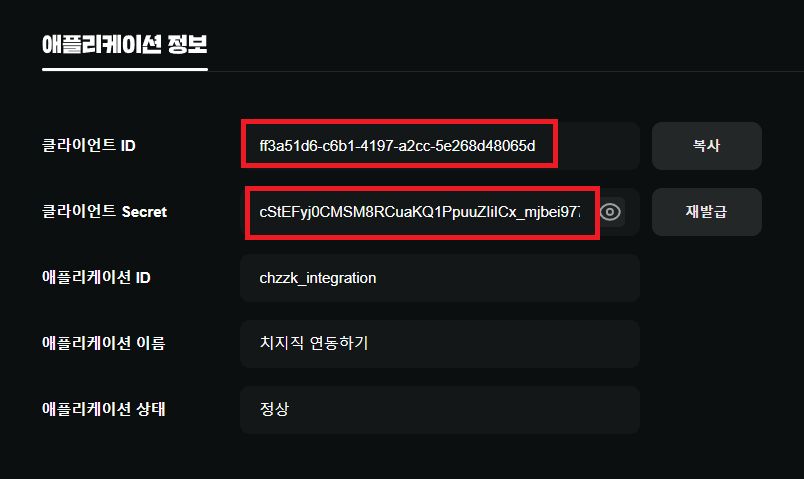

# Getting Started
이 페이지에서는 [설치](Installation.md) 이후 `chzzk4j`를 시작하는 내용에 대해 다룹니다.

## API 키 발급

공식 API 키 없이도 `chzzk4j`를 사용할 수 있습니다만, 몇몇 기능에 제한이 생길 수도 있습니다.


`chzzk4j`의 모든 기능을 활용하기 위해서는 치지직의 공식 API 키를 발급받아야 합니다.
1. [치지직 Developers](https://developers.chzzk.naver.com) 페이지에 로그인하고 내 서비스 버튼을 클릭합니다.<br/>
   
2. 애플리케이션 목록에서 '애플리케이션 등록'을 클릭해서 관련 정보를 입력하고, 애플리케이션을 생성합니다.
   - 인증이 필요하지 않다면 로그인 리디렉션 URL은 `http://localhost:8080`으로 설정합니다.
   - 애플리케이션에 필요한 API Scope를 선택합니다.
3. 클라이언트 ID와 Secret을 복사합니다.<br/>
   

## ChzzkClient 생성
`ChzzkClientBuilder`를 통해 `ChzzkClient`를 생성합니다.



```java
ChzzkClient client = new ChzzkClientBuilder("API_CLIENT_ID", "API_SECRET")
//      .withDebugMode() // 디버그 로그를 확인하고 싶다면 활성화할 수 있습니다.
        .build();
```


```java
ChzzkClient client = new ChzzkClientBuilder()
//      .withDebugMode() // 디버그 로그를 확인하고 싶다면 활성화할 수 있습니다.
        .build();
```

